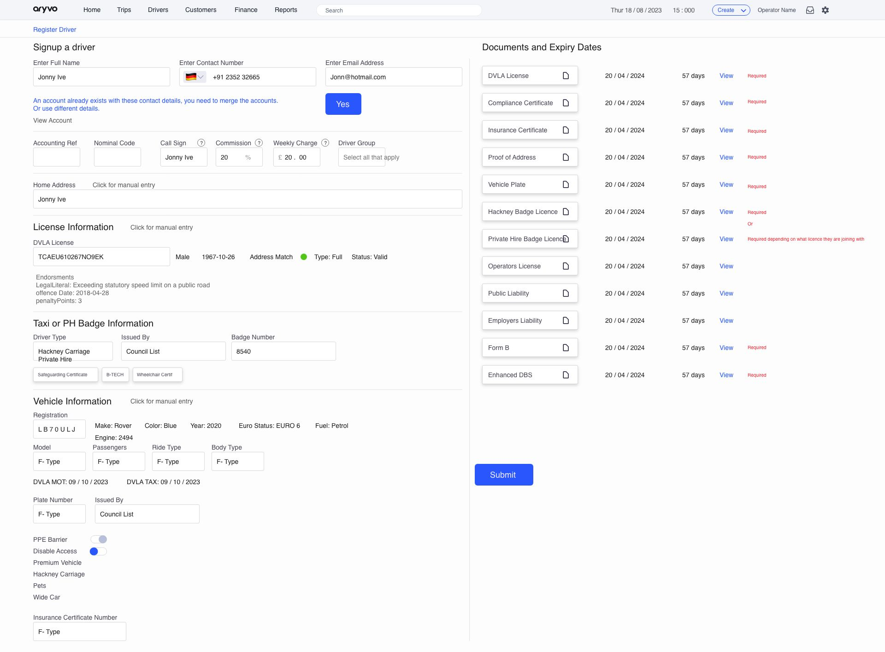

# Aryvo Frontend Task

This project, developed for Aryvo, highlights my expertise in frontend development by seamlessly translating design specifications into a pixel-perfect, dynamic, and universally compatible user interface. The addition of Firebase authentication simplifies the login process, ensuring a secure and straightforward web application. With a focus on clean and responsive design, the UI aligns precisely with provided specifications, delivering an optimal user experience.

<center>
  
  <p >Description of the image.</p>
</center>

## Dummy Credentials
 
```
Email: test@gmail.com
```
```
Password: test@123
```

## Folder Structure
```
root/
├── public/
├── src/
    ├── assets/
    ├── components/
    ├── customHooks/
    ├── firebase/
    ├── pages/
    ├── App.css
    ├── App.tsx
    ├── index.css
    ├── main.tsx
    └── vite-env.d.ts
```

- **public**: Public assets 
- **src**: Source code directory.
  - **assets**: Project assets such as images, fonts, etc.
  - **components**: Reusable React components.
  - **customHooks**: Custom React hooks.
  - **firebase**: Firebase configuration and authentication logic.
  - **pages**: React components representing different pages.
  - **App.css**: Main CSS file for the application.
  - **App.tsx**: Main React component.
  - **index.css**: Index CSS file.
  - **main.tsx**: Entry point of the application.
  - **vite-env.d.ts**: TypeScript declarations for Vite.

## Environment Variables

- **.env**: Configuration file for environment variables.
```
REACT_APP_FIREBASE_API_KEY=your_api_key
REACT_APP_FIREBASE_AUTH_DOMAIN=your_auth_domain
REACT_APP_FIREBASE_PROJECT_ID=your_project_id
REACT_APP_FIREBASE_STORAGE_BUCKET=your_storage_bucket
REACT_APP_FIREBASE_MESSAGING_SENDER_ID=your_messaging_sender_id
REACT_APP_FIREBASE_APP_ID=your_app_id
REACT_APP_FIREBASE_MEASUREMENT_ID=your_measurement_id
```

### Installation

1. Clone the repository to your local machine:
   ```shell
   git clone git@github.com:Paras0750/Aryvo-Frontend-Task.git
   ```
2. Navigate to backend:
   ```shell
   cd Aryvo-Frontend-Task
   npm install
   ```
3. Start Backend:
   ```shell
   npm run dev
   ```

